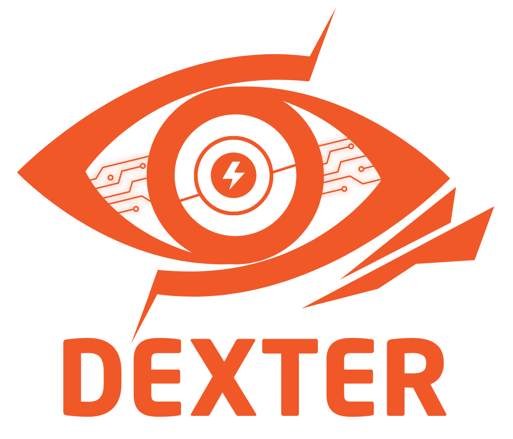

<p align="center">
  
</p>

<h1 align="center">Dexter — AI-Powered Intrusion Detection System</h1>

<p align="center">
  <strong>Real-time network threat monitoring dashboard built with Electron</strong>
</p>

<p align="center">
  
  
  
  
  
  
</p>

---

## Overview

**Dexter** is a cybersecurity dashboard designed for monitoring network intrusions, analyzing threats in real time, and managing security alerts. Built as a desktop application with Electron, it features a custom design system with cybersecurity-themed motion language and a dark interface optimized for SOC (Security Operations Center) workflows.

> **Note:** This is the frontend dashboard module. The backend IDS engine (packet sniffer, ML model, FastAPI) is developed separately.

---

## Features

- **4-Page Dashboard** — Overview, Live Alerts, System Status, System Logs
- **20+ Realistic Alert Types** — Port Scan, SQL Injection, Ransomware C2, Zero-Day, Brute Force, ARP Spoofing, XSS, Reverse Shell, and more
- **Interactive Charts** — Threat timeline, attack type distribution, and stat-card sparklines (Chart.js)
- **Smart Filtering** — Multi-select severity filters, service filters, log level filters with custom dropdown components
- **Global Search** — Search across alerts by IP, type, protocol, or any keyword
- **Alert Detail Modal** — Full alert inspection with raw JSON data and one-click export
- **Export** — Download alerts and logs as JSON
- **System Status** — Live component health view (Network Sniffer, Database, FastAPI, ML Model, Analytics, Rule Engine)
- **System Resources** — CPU, Memory, Disk, Network I/O monitoring bars
- **Pagination** — Both alerts and logs support paginated views
- **Responsive Design** — Breakpoints at 1200px and 768px with collapsible sidebar
- **Dexter Motion System** — 5 custom cubic-bezier easing curves and 5 duration combos for consistent animations
- **Desktop App** — Electron packaging with NSIS installer, desktop shortcut, and near-fullscreen window

---

## Screenshots

<p align="center">
  <em>Overview Dashboard — threat timeline, attack distribution, top sources</em>
</p>

> Add your screenshots here: place images in a `screenshots/` folder and reference them as ``

---

## Tech Stack

| Layer | Technology |
|-------|-----------|
| Desktop Shell | Electron 40.x |
| Frontend | HTML5, CSS3, Vanilla JavaScript (ES6+) |
| Charts | Chart.js 4.x |
| Icons | Font Awesome 6.4, Bootstrap Icons 1.13 |
| Font | Exo 2 (Google Fonts) |
| Build | electron-builder (NSIS) |
| Design System | Custom CSS variables + Dexter Motion System |

---

## Project Structure

```
dexter/
├── main.js                 # Electron main process
├── preload.js              # Secure IPC bridge (contextBridge)
├── package.json            # Dependencies & electron-builder config
├── build/
│   └── icon.ico            # App icon (multi-size)
└── dashboard/
    ├── index.html          # Single-page app (4 views)
    ├── css/
    │   ├── style.css       # Main stylesheet (~2400 lines)
    │   └── responsive.css  # Media query breakpoints
    ├── js/
    │   └── app.js          # Application logic (~1200 lines)
    └── images/
        └── logo.png        # Dexter logo
```

---

## Getting Started

### Prerequisites

- [Node.js](https://nodejs.org/) 18+ 
- npm 9+

### Installation

```bash
# Clone the repository
git clone https://github.com/YOUR_USERNAME/dexter.git
cd dexter

# Install dependencies
npm install

# Run in development mode
npm run dev
```

### Build Desktop App

```bash
# Build Windows installer (.exe)
npm run dist

# Output: dist/Dexter Setup x.x.x.exe
```

---

## Design System — Dexter Motion Language

The dashboard uses a custom motion system inspired by cybersecurity concepts:

| Curve | CSS Variable | Character |
|-------|-------------|-----------|
| Scan | `--ease-scan` | Scanner sweep — fast pickup, smooth settle |
| Lock | `--ease-lock` | Security lock — deliberate, final engagement |
| Alert | `--ease-alert` | Threat alarm — instant sharp response |
| Pulse | `--ease-pulse` | Heartbeat — alive tension, micro-overshoot |
| Fade | `--ease-fade` | Stealth — symmetric, non-distracting |

All transitions reference these variables — zero hardcoded timing functions.

---

## Roadmap

- [ ] Backend API integration (FastAPI + WebSocket)
- [ ] Real-time packet capture via Scapy/Suricata
- [ ] ML anomaly detection model (scikit-learn / PyTorch)
- [ ] PostgreSQL alert persistence
- [ ] Auto-update mechanism (electron-updater)
- [ ] Dark/light theme toggle
- [ ] Alert notification system (system tray)
- [ ] User authentication & role management

---

## Contributing

1. Fork the repository
2. Create your feature branch (`git checkout -b feature/amazing-feature`)
3. Commit your changes (`git commit -m 'Add amazing feature'`)
4. Push to the branch (`git push origin feature/amazing-feature`)
5. Open a Pull Request

---

## License

Distributed under the MIT License. See [LICENSE](LICENSE) for more information.

---

<p align="center">
  Built with precision by <strong>Dexter Team</strong>
</p>
